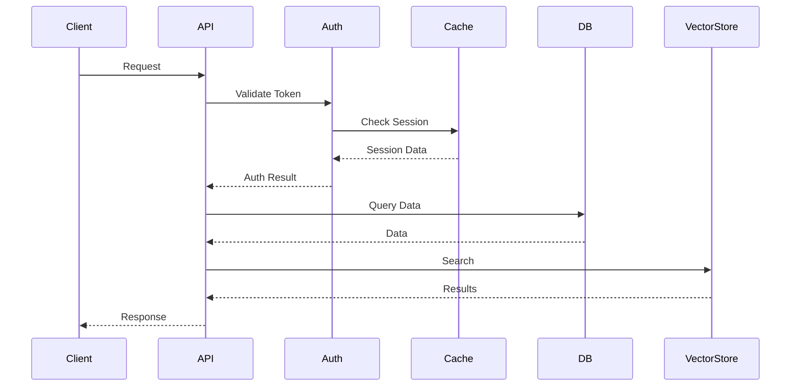

# Agentic RAG System Technical Specification

## 1. System Architecture

### 1.1 High-Level Architecture
```
┌─────────────────────────────────────────────────────────────┐
│                      Client Layer                           │
│  ┌─────────────┐    ┌─────────────┐    ┌─────────────┐     │
│  │  Streamlit  │    │    REST     │    │  WebSocket  │     │
│  │     UI      │    │    API      │    │  Client     │     │
│  └─────────────┘    └─────────────┘    └─────────────┘     │
└───────────────────────────┬─────────────────────────────────┘
                            │
┌───────────────────────────▼─────────────────────────────────┐
│                      API Layer                              │
│  ┌─────────────┐    ┌─────────────┐    ┌─────────────┐     │
│  │  FastAPI    │    │  Auth       │    │  WebSocket  │     │
│  │  Server     │    │  Middleware │    │  Server     │     │
│  └─────────────┘    └─────────────┘    └─────────────┘     │
└───────────────────────────┬─────────────────────────────────┘
                            │
┌───────────────────────────▼─────────────────────────────────┐
│                      Service Layer                          │
│  ┌─────────────┐    ┌─────────────┐    ┌─────────────┐     │
│  │  Auth       │    │  Cache      │    │  Versioning │     │
│  │  Service    │    │  Service    │    │  Service    │     │
│  └─────────────┘    └─────────────┘    └─────────────┘     │
│  ┌─────────────┐    ┌─────────────┐    ┌─────────────┐     │
│  │  Document   │    │  Query      │    │  Analytics  │     │
│  │  Service    │    │  Service    │    │  Service    │     │
│  └─────────────┘    └─────────────┘    └─────────────┘     │
└───────────────────────────┬─────────────────────────────────┘
                            │
┌───────────────────────────▼─────────────────────────────────┐
│                      Storage Layer                          │
│  ┌─────────────┐    ┌─────────────┐    ┌─────────────┐     │
│  │  SQLite/    │    │   Redis     │    │  Vector     │     │
│  │  PostgreSQL │    │   Cache     │    │  Store      │     │
│  └─────────────┘    └─────────────┘    └─────────────┘     │
└─────────────────────────────────────────────────────────────┘
```

### 1.2 Component Interaction


## 2. Technical Components

### 2.1 Authentication System

#### 2.1.1 JWT Implementation
```python
# Token Structure
{
    "sub": "user_id",
    "exp": "expiration_timestamp",
    "iat": "issued_at_timestamp",
    "role": "user_role",
    "type": "access|refresh"
}
```

#### 2.1.2 Security Measures
- Token encryption using HS256
- Refresh token rotation
- Token blacklisting
- Rate limiting per user/IP
- Password hashing with bcrypt

### 2.2 Caching System

#### 2.2.1 Cache Hierarchy
```
┌─────────────────┐
│   Application   │
└────────┬────────┘
         │
┌────────▼────────┐
│   Redis Cache   │
└────────┬────────┘
         │
┌────────▼────────┐
│  Database/File  │
└─────────────────┘
```

#### 2.2.2 Cache Categories
| Category    | TTL      | Purpose                    |
|-------------|----------|----------------------------|
| Query       | 1 hour   | Query results              |
| Document    | 24 hours | Document metadata          |
| User        | 30 min   | User session data          |
| Session     | 7 days   | Active sessions            |
| Analytics   | 5 min    | Analytics data             |

### 2.3 Document Versioning

#### 2.3.1 Version Control Model
```sql
-- Document Versions Table
CREATE TABLE document_versions (
    version_id TEXT PRIMARY KEY,
    document_id TEXT NOT NULL,
    version_number INTEGER NOT NULL,
    content_hash TEXT NOT NULL,
    metadata TEXT NOT NULL,
    created_at TIMESTAMP NOT NULL,
    created_by TEXT NOT NULL,
    changes TEXT,
    FOREIGN KEY (document_id) REFERENCES documents(id),
    FOREIGN KEY (created_by) REFERENCES users(id)
);

-- Version Tags Table
CREATE TABLE version_tags (
    tag_id TEXT PRIMARY KEY,
    version_id TEXT NOT NULL,
    tag_name TEXT NOT NULL,
    description TEXT,
    created_at TIMESTAMP NOT NULL,
    created_by TEXT NOT NULL,
    FOREIGN KEY (version_id) REFERENCES document_versions(version_id)
);
```

#### 2.3.2 Version Operations
- Create version
- Compare versions
- Rollback to version
- Tag version
- List versions

### 2.4 Vector Store Integration

#### 2.4.1 Supported Vector Stores
1. **ChromaDB**
   - Default vector store
   - In-memory and persistent modes
   - Automatic index optimization

2. **Qdrant**
   - Alternative vector store
   - Distributed deployment support
   - Advanced filtering capabilities

#### 2.4.2 Vector Operations
```python
# Vector Store Interface
class VectorStore:
    async def add_documents(self, documents: List[Document]) -> List[str]
    async def search(self, query: str, k: int = 5) -> List[SearchResult]
    async def delete_documents(self, document_ids: List[str]) -> bool
    async def update_documents(self, documents: List[Document]) -> bool
```

### 2.5 Real-time Updates

#### 2.5.1 WebSocket Protocol
```json
// Message Format
{
    "type": "document_update|user_update|system_update",
    "action": "create|update|delete",
    "data": {
        "id": "entity_id",
        "changes": {},
        "timestamp": "ISO8601"
    }
}
```

#### 2.5.2 Subscription Model
```python
class SubscriptionManager:
    def subscribe_document(self, user_id: str, document_id: str)
    def unsubscribe_document(self, user_id: str, document_id: str)
    def subscribe_user(self, user_id: str, target_user_id: str)
    def broadcast_update(self, channel: str, message: dict)
```

## 3. API Specifications

### 3.1 REST API

#### 3.1.1 Authentication Endpoints
```yaml
/auth/register:
  post:
    request:
      email: string
      password: string
      full_name: string
    response:
      user: User
      token: Token

/auth/login:
  post:
    request:
      email: string
      password: string
    response:
      access_token: string
      refresh_token: string
      user: User
```

#### 3.1.2 Document Endpoints
```yaml
/documents:
  post:
    request:
      title: string
      content: string
      metadata: object
    response:
      document: Document

/documents/{document_id}/versions:
  get:
    parameters:
      limit: integer
      offset: integer
    response:
      versions: List[Version]
```

### 3.2 WebSocket API

#### 3.2.1 Connection
```javascript
// Client Connection
const ws = new WebSocket(`ws://localhost:8000/ws/${userId}`);

// Authentication
ws.send(JSON.stringify({
    type: "auth",
    token: "jwt_token"
}));
```

#### 3.2.2 Message Types
```typescript
interface WebSocketMessage {
    type: "document_update" | "user_update" | "system_update";
    action: "create" | "update" | "delete";
    data: {
        id: string;
        changes?: object;
        timestamp: string;
    };
}
```

## 4. Data Models

### 4.1 Core Models

#### 4.1.1 User Model
```python
class User(BaseModel):
    id: UUID
    email: EmailStr
    full_name: str
    role: UserRole
    created_at: datetime
    updated_at: datetime
    is_active: bool
```

#### 4.1.2 Document Model
```python
class Document(BaseModel):
    id: UUID
    title: str
    content: str
    metadata: Dict[str, Any]
    created_by: UUID
    created_at: datetime
    updated_at: datetime
    version: int
    status: DocumentStatus
```

### 4.2 Database Schema

#### 4.2.1 Core Tables
```sql
-- Users Table
CREATE TABLE users (
    id UUID PRIMARY KEY,
    email TEXT UNIQUE NOT NULL,
    password_hash TEXT NOT NULL,
    full_name TEXT NOT NULL,
    role TEXT NOT NULL,
    created_at TIMESTAMP NOT NULL,
    updated_at TIMESTAMP NOT NULL,
    is_active BOOLEAN NOT NULL DEFAULT true
);

-- Documents Table
CREATE TABLE documents (
    id UUID PRIMARY KEY,
    title TEXT NOT NULL,
    content TEXT NOT NULL,
    metadata JSONB NOT NULL,
    created_by UUID NOT NULL,
    created_at TIMESTAMP NOT NULL,
    updated_at TIMESTAMP NOT NULL,
    status TEXT NOT NULL,
    FOREIGN KEY (created_by) REFERENCES users(id)
);
```

## 5. Performance Considerations

### 5.1 Caching Strategy

#### 5.1.1 Cache Invalidation
```python
class CacheInvalidation:
    def invalidate_document(self, document_id: str)
    def invalidate_user(self, user_id: str)
    def invalidate_query(self, query_hash: str)
    def clear_category(self, category: str)
```

#### 5.1.2 Cache Optimization
- LRU eviction policy
- TTL-based expiration
- Batch operations
- Compression for large values

### 5.2 Database Optimization

#### 5.2.1 Indexes
```sql
-- Document Search Index
CREATE INDEX idx_documents_search 
ON documents 
USING gin (to_tsvector('english', title || ' ' || content));

-- Version Lookup Index
CREATE INDEX idx_document_versions 
ON document_versions (document_id, version_number);
```

#### 5.2.2 Query Optimization
- Prepared statements
- Connection pooling
- Query caching
- Batch operations

### 5.3 API Performance

#### 5.3.1 Response Time Targets
| Endpoint Type    | Target Response Time |
|------------------|---------------------|
| Authentication   | < 100ms             |
| Document CRUD    | < 200ms             |
| Query Processing | < 500ms             |
| Analytics        | < 1s                |

#### 5.3.2 Optimization Techniques
- Response compression
- Pagination
- Field filtering
- Batch processing

## 6. Security Measures

### 6.1 Authentication Security

#### 6.1.1 Password Policy
```python
PASSWORD_POLICY = {
    "min_length": 8,
    "require_uppercase": True,
    "require_lowercase": True,
    "require_numbers": True,
    "require_special": True,
    "max_age_days": 90
}
```

#### 6.1.2 Token Security
```python
TOKEN_CONFIG = {
    "access_token_expire_minutes": 30,
    "refresh_token_expire_days": 7,
    "algorithm": "HS256",
    "token_rotation": True
}
```

### 6.2 API Security

#### 6.2.1 Rate Limiting
```python
RATE_LIMIT_CONFIG = {
    "requests": 100,
    "window": 3600,
    "by_ip": True,
    "by_user": True
}
```

#### 6.2.2 Input Validation
```python
class InputValidator:
    def validate_document(self, document: Document) -> bool
    def validate_query(self, query: Query) -> bool
    def sanitize_input(self, input: str) -> str
```

## 7. Monitoring and Logging

### 7.1 Metrics Collection

#### 7.1.1 Key Metrics
```python
METRICS = {
    "api": {
        "request_count": Counter,
        "response_time": Histogram,
        "error_count": Counter
    },
    "cache": {
        "hit_rate": Gauge,
        "miss_rate": Gauge,
        "eviction_count": Counter
    },
    "database": {
        "query_time": Histogram,
        "connection_count": Gauge,
        "error_count": Counter
    }
}
```

#### 7.1.2 Health Checks
```python
class HealthCheck:
    def check_api(self) -> HealthStatus
    def check_database(self) -> HealthStatus
    def check_cache(self) -> HealthStatus
    def check_vector_store(self) -> HealthStatus
```

### 7.2 Logging Strategy

#### 7.2.1 Log Levels
```python
LOG_LEVELS = {
    "api": "INFO",
    "auth": "WARNING",
    "cache": "DEBUG",
    "database": "INFO",
    "vector_store": "INFO"
}
```

#### 7.2.2 Log Format
```python
LOG_FORMAT = {
    "timestamp": "%(asctime)s",
    "level": "%(levelname)s",
    "module": "%(module)s",
    "function": "%(funcName)s",
    "line": "%(lineno)d",
    "message": "%(message)s"
}
```

## 8. Deployment Architecture

### 8.1 Development Environment
```
┌─────────────┐    ┌─────────────┐    ┌─────────────┐
│  Streamlit  │    │   FastAPI   │    │   Redis     │
│     UI      │    │    API      │    │   Cache     │
└─────────────┘    └─────────────┘    └─────────────┘
```

### 8.2 Production Environment
```
┌─────────────────┐    ┌─────────────────┐
│   Load Balancer │    │   Redis Cluster │
└────────┬────────┘    └────────┬────────┘
         │                      │
┌────────▼────────┐    ┌────────▼────────┐
│  API Servers    │    │  Vector Store   │
│  (Multiple)     │    │  Cluster        │
└────────┬────────┘    └────────┬────────┘
         │                      │
┌────────▼────────┐    ┌────────▼────────┐
│  Database       │    │  File Storage   │
│  Cluster        │    │  (S3/Cloud)     │
└─────────────────┘    └─────────────────┘
```

## 9. Future Technical Roadmap

### 9.1 Planned Improvements
1. **Scalability**
   - Microservices architecture
   - Kubernetes deployment
   - Distributed caching
   - Sharded database

2. **Performance**
   - Query optimization
   - Cache improvements
   - Async processing
   - Batch operations

3. **Security**
   - OAuth2 integration
   - 2FA support
   - Audit logging
   - Encryption at rest

4. **Monitoring**
   - APM integration
   - Custom dashboards
   - Alert system
   - Performance profiling

### 9.2 Technical Debt
1. **Code Quality**
   - Test coverage improvement
   - Documentation updates
   - Code refactoring
   - Dependency updates

2. **Infrastructure**
   - CI/CD pipeline
   - Infrastructure as Code
   - Automated testing
   - Deployment automation 